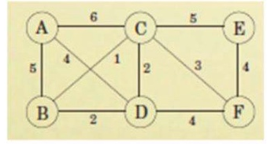
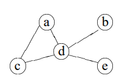

# 10 Minimum Spanning Tree

1. Write a program to perform Prim’s Algorithm with all its intermediate
output.

 

2. Write a program to perform Kruskal’s Algorithm with all its intermediate
output.
    
 

3. Write a program to give all the possible spanning tree solution for the below
given graph.

